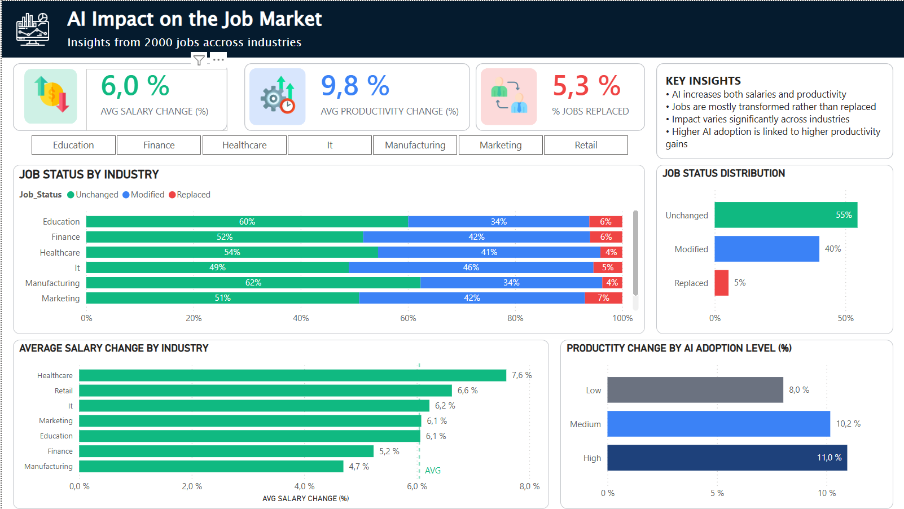

# Analyse de l’impact de l’IA sur le marché du travail

## Objectif

Analyser l’impact de l’intelligence artificielle sur le marché du travail à travers :
- les salaires
- la transformation des emplois
- la productivité
- la satisfaction

## Outils
- Python (Pandas, NumPy)
- Matplotlib & Seaborn
- Jupyter Notebook
- Dataset kaggle (**dataset synthétique**)

Le dataset contient des informations sur :
- métiers (Job_Role)
- secteurs (Industry)
- adoption de l’IA (AI_Adoption_Level)
- risque d’automatisation (Automation_Risk)
- salaires, productivité, satisfaction

*Dataset inclus pour garantir la reproductibilité.*

## Analyse
1. Impact global de l’IA
- Les salaires augmentent-ils ?
> Analyse : Hausse moyenne des salaires, Distribution des variations

> Insight : Les salaires augmentent en moyenne (~+6%), forte variabilité selon les contextes.

- Répartition des statuts d’emploi
> Analyse : Majorité des emplois inchangés ou modifiés, faible proportion de postes remplacés

> Insight : L’IA transforme davantage les emplois qu’elle ne les remplace

2. Impact par industrie
- Quelles industries sont les plus impactées ?
> Analyse : Santé, retail et IT → plus fortes hausses de salaires, santé et retail → moins exposés au remplacement

> Insight : Les métiers moins automatisables sont à la fois mieux rémunérés et plus protégés.

3. Impact par métier
- Quels métiers gagnent le plus ?
> Analyse : Tous les métiers connaissent une hausse mais avec des écarts significatifs

> Insight : Les métiers qualifiés et à forte dimension humaine bénéficient davantage de l’IA.

4. Expérience vs impact
- L’expérience protège-t-elle ?
> Analyse : Seniors légèrement plus exposés au remplacement, profils intermédiaires plus stables. Tous les niveaux bénéficient d’une hausse salariale.

> Insight : L’impact de l’IA n’est pas linéaire selon l’expérience.

5. IA & automatisation
- Adoption de l’IA vs impact
> Analyse : le risque d’automatisation prédit fortement le statut des emplois, l’adoption réelle montre un impact progressif

> Insight : L’IA transforme les emplois de manière graduelle, le remplacement restant limité.

6. Upskilling
- L’upskilling protège-t-il ?

> Analyse : peu d’impact sur le statut des emplois, effet positif sur les salaires (+0.9 pts)

> Insight : L’upskilling valorise les emplois sans garantir leur protection.

7. Productivité & satisfaction
- Productivité
> Analyse : productivité augmente avec l’adoption (8% → 11%), pertes réduites mais persistantes

>Insight : L’IA améliore la productivité tout en réduisant les baisses de performance.

- Satisfaction
> Analyse : satisfaction stable (~6/10), peu de variation selon le statut

> Insight : L’impact de l’IA sur la satisfaction est limité.

## Key Insights
- L’IA a un impact globalement positif sur les salaires et la productivité
- Elle transforme les emplois plus qu’elle ne les remplace
- Les effets sont hétérogènes selon les secteurs et les métiers
- Le risque d’automatisation est un bon prédicteur théorique
- L’adoption réelle de l’IA entraîne un impact progressif et non uniforme
- L’upskilling améliore la valeur des emplois sans garantir leur sécurité
- L’IA réduit les pertes de productivité sans les éliminer
- La satisfaction des employés reste globalement stable

## Conclusion

L’intelligence artificielle agit principalement comme un levier de transformation du travail.  
Elle améliore la performance globale, mais ses effets restent variables selon les métiers, les secteurs et les niveaux d’adoption.

## Dashboard Overview


## Structure du projet
```text
├── data/
│     raw/
│       └──ai_job_impact.csv
│     cleaned/
│       └── ai_job_impact_cleaned.csv
├── notebook/
│   └── ai_job_impact_analysis.ipynb
├── images/
│   └── dashboard.png
└── README.md
```
## Auteur

Projet réalisé dans le cadre d’une montée en compétences en Data Analysis.
